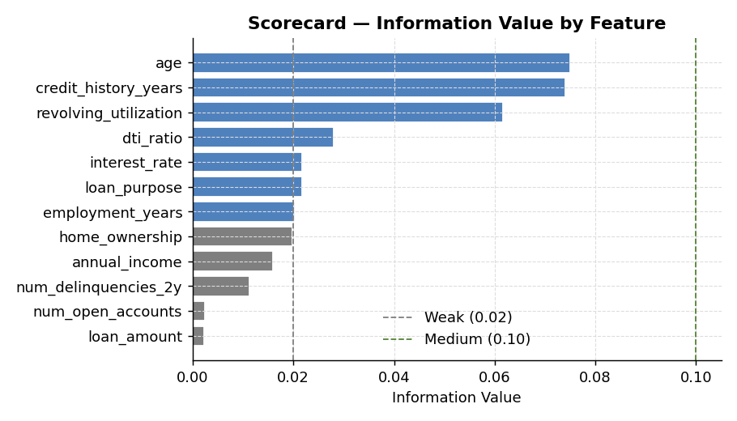
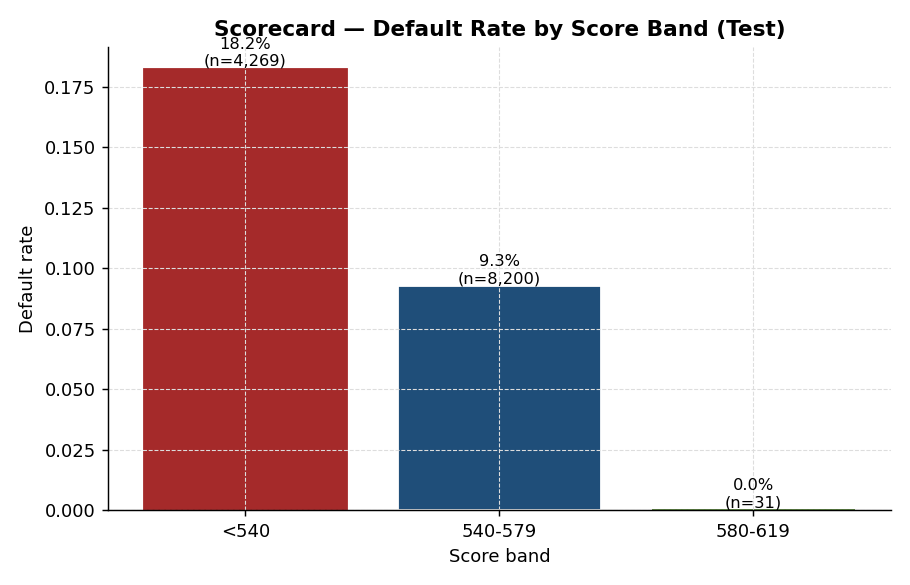
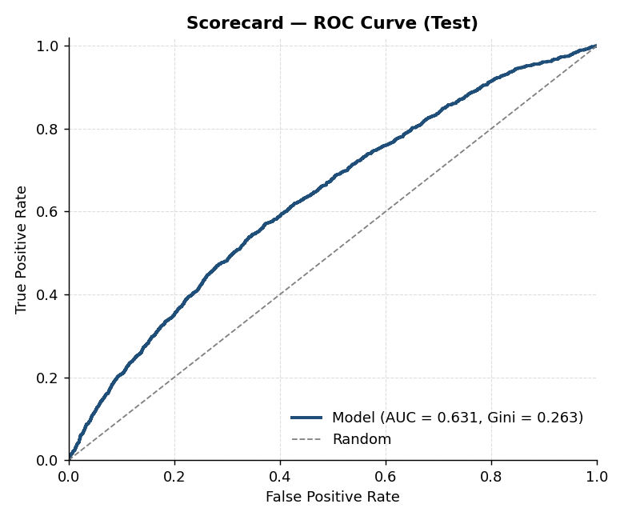
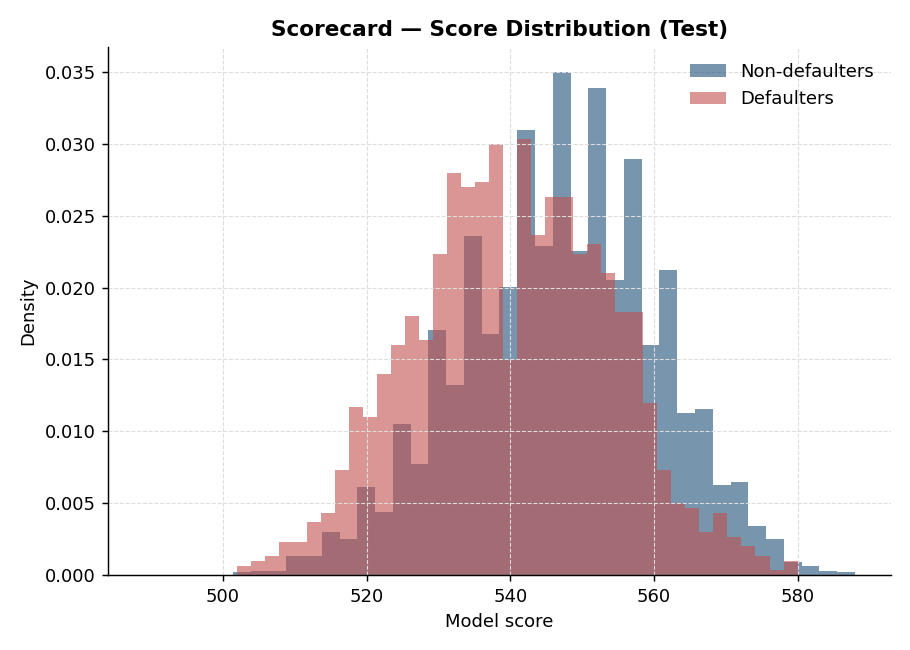

# Application Credit Scorecard

## What this does

Builds a points-based application scorecard, the format used by FICO, VantageScore, and every internal-bank scoring shop. The output is a literal points table: each input feature is binned, each bin gets a point value, and an applicant's score is the sum of their bin points plus a base score.

## Why points instead of just a probability?

- **Interpretability** — underwriters and call-center staff can read a score and tell an applicant *why* they were declined ("your DTI bin contributes -22 points").
- **Adverse-action notices** — US lenders are required by ECOA / Reg B to tell declined applicants the principal reasons. Points-based scorecards make this trivial.
- **Stability** — a points table is a static lookup; no Python runtime needed at the point of decision.
- **Regulatory comfort** — model risk teams have decades of experience with this format. Logistic-regression-on-WoE remains the dominant choice for application scoring.

## The pipeline

1. **WoE binning** — each numeric feature is split into ~8 quantile bins; each bin gets a Weight of Evidence value, `ln(% goods / % bads)`. Categorical features are binned by category.
2. **Information Value ranking** — IV summarizes feature predictive power. Features with IV < 0.02 are dropped as noise; IV > 0.5 are flagged for leakage review.
3. **Logistic regression on WoE-transformed inputs** — coefficients should all come out positive (WoE is constructed so that higher = lower risk).
4. **Scaling to points** — using the standard PDO (Points to Double the Odds) construction. Defaults: base score 600 @ 50:1 odds, PDO 20. So every 20 points doubles the odds of being good.
5. **Validation** — KS, Gini, calibration, default rate by score band.

## Output

Running the script produces:

- An IV ranking of every candidate feature
- The fitted logit coefficients (with a sanity check: all positive)
- KS / Gini / Brier on train and test
- A printable points table with bin, count, bad rate, WoE, and points
- A score-band default rate table — the artifact you'd actually deploy

## Run it

```bash
python scorecard.py
```

This emits the IV ranking, points table, KS/Gini metrics, and score-band default rates to stdout, plus four charts to `charts/`:

### Information Value


IV by feature. The 0.02 threshold (drop as noise) and 0.10 threshold (medium predictive power) are marked. Anything above 0.50 should be reviewed for leakage; here all features fall in the medium-strong range.

### Default rate by score band


The deployment artifact: as score band increases, default rate falls monotonically. This is the table underwriters use for cut-off decisions.

### ROC curve


ROC and Gini on the test sample.

### Score distribution


Score distribution split by realized outcome. Visible separation between defaulters and non-defaulters is the discriminatory power.

## Production notes

In a real deployment you'd add:
- **Manual bin overrides** — some bins get merged for monotonicity (e.g., default rate must decrease as bureau score increases).
- **Reject inference** — the development sample only contains booked loans; declined applicants are missing-not-at-random. Reject inference (parcelling, augmentation, fuzzy parcelling) corrects for this. Out of scope for this synthetic demo since we don't have a reject population.
- **Override codes** — judgmental overrides on top of the score (fraud flags, collections, bankruptcy).
- **Score cutoff calibration** — chosen to hit the bank's target booked-loan default rate at the desired approval rate.
