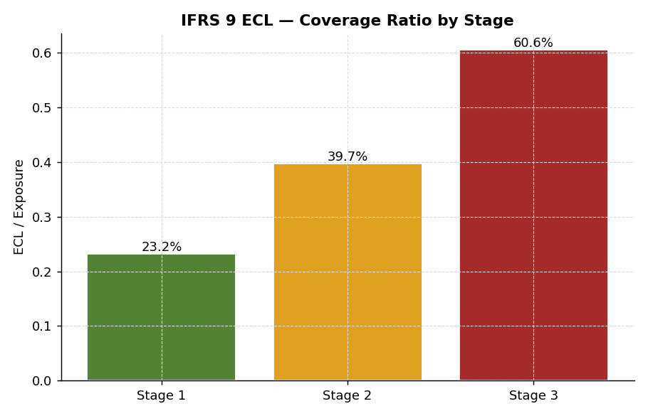
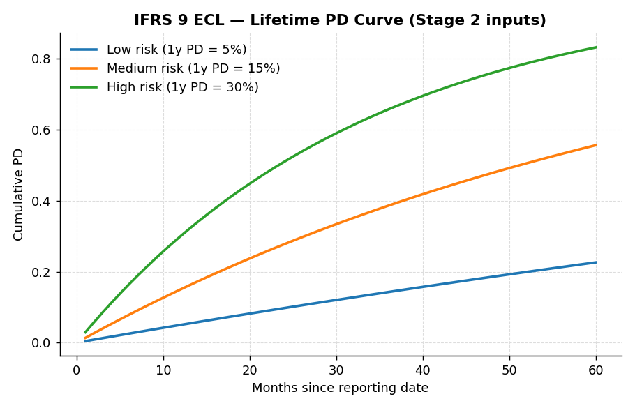

# IFRS 9 Expected Credit Loss

## What this does

Computes Expected Credit Loss (ECL) — the loan-loss provision banks book in their financial statements under IFRS 9 (international) or CECL (US GAAP, Topic 326). It ties together PD, LGD, and EAD into the number that lands in the income statement.

## The formula

For each loan:

> **ECL = Σ over remaining months of  (marginal PD × LGD × EAD × discount factor)**

…with the time horizon depending on the loan's IFRS 9 stage:

| Stage | Trigger | Horizon |
|---|---|---|
| **Stage 1** | Performing, no significant increase in credit risk (SICR) | 12 months |
| **Stage 2** | SICR triggered (e.g., PD has doubled since origination) | Lifetime |
| **Stage 3** | Credit-impaired (defaulted) | Lifetime, with PD = 100% |

## Components in this implementation

1. **Stage classification** — uses a PD-ratio SICR trigger (current 12-month PD / origination PD ≥ 2x), with a delinquency backstop. Defaulted loans go straight to Stage 3.
2. **Lifetime PD curve** — converts a 12-month PD into a per-month marginal PD using a constant-hazard assumption: `λ_monthly such that (1 - λ)^12 = 1 - PD_12m`. Real shops layer macroeconomic factors on top (the "Forward-Looking Information" requirement under IFRS 9.5.5.4).
3. **EAD path** — full amortization schedule month-by-month, so EAD declines as the loan amortizes. For revolving products you'd use a Credit Conversion Factor (CCF) instead.
4. **Discounting** — at the loan's effective interest rate (here simplified to a flat 5% annual rate).
5. **LGD** — pulled in as a portfolio average by loan purpose. In production this is the output of your dedicated LGD model (see `../lgd-modeling/`).

## Output

Running the script produces the IFRS 9 portfolio summary you'd put in front of finance:

- Stage distribution (count of loans, % of book)
- Total exposure per stage
- Total ECL per stage
- Coverage ratio (ECL / exposure) per stage and overall

## Run it

```bash
python ecl_calculation.py            # compute ECL + save charts + emit results.json
python build_executive_summary.py    # (optional) build IFRS9_ECL_Executive_Summary.pdf
```

`ecl_calculation.py` saves three charts to `charts/` and a `results.json` summary; `build_executive_summary.py` consumes both to produce a one-page-per-section PDF for finance / risk-committee distribution.

## Charts

### Stage breakdown


Account counts (left) and ECL provision (right) by IFRS 9 stage. Stage 3 is small in count but large in ECL — typical of a portfolio at any reporting date.

### Coverage ratio by stage


ECL / exposure ratio by stage. Stage 1 books only 12-month ECL and shows the lowest coverage; Stage 3 is credit-impaired and tracks LGD directly.

### Lifetime PD construction


Cumulative PD over a 60-month horizon for three illustrative risk levels. The constant-hazard transformation produces the marginal PD inputs for Stage 2 lifetime ECL.

## Companion artifact

- **`IFRS9_ECL_Executive_Summary.pdf`** — concise risk-committee summary: KPIs, stage breakdown table, embedded charts, methodology note. Generated from `results.json` by `build_executive_summary.py`.

## What's intentionally not here

- **Macroeconomic overlays** — the "FLI" requirement. In real ECL, scenarios are weighted (typically baseline / upside / downside, often 40/30/30 or similar) and the macro variables (unemployment, GDP growth, HPI) shift the PD curves up or down.
- **POCI loans** — purchased or originated credit-impaired. Special accounting where a credit-adjusted EIR applies.
- **Behavioural lifetime for revolving products** — credit cards don't have a contractual maturity, so banks model expected behavioural lives (typically 3–7 years).
- **Management overlays** — the post-model adjustments that almost always show up in real ECL numbers, especially in periods of stress (COVID, rate cycles).
