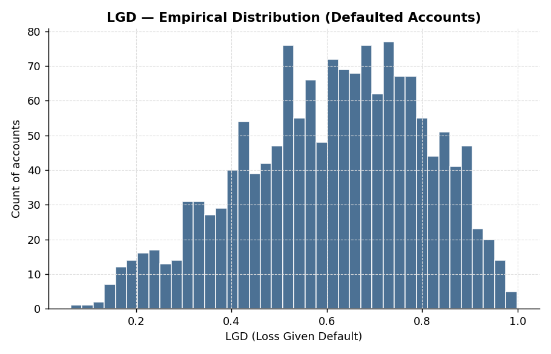
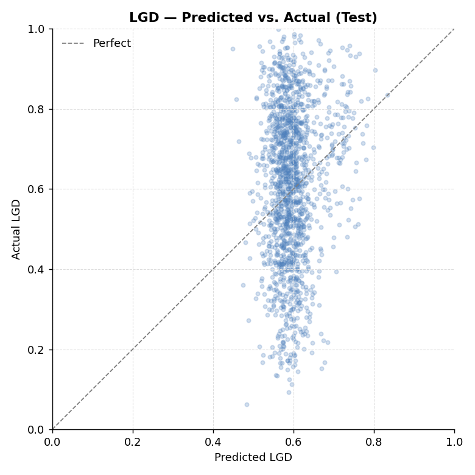
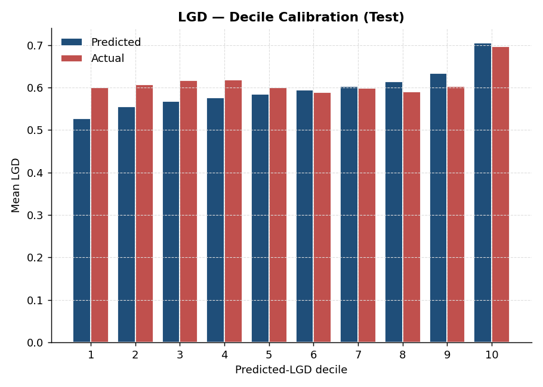

# Loss Given Default (LGD) Modeling

## What this does

Predicts how much of a defaulted exposure will ultimately be lost, after recoveries from collections, collateral liquidation, and sales to debt buyers.

LGD is one of three legs of the regulatory loss formula:

> **Expected Loss = PD × LGD × EAD**

A lender with a 2% PD and 40% LGD on a $10K loan expects to lose `0.02 × 0.40 × $10,000 = $80` per loan over the horizon.

## Why a two-stage model

Empirical LGD distributions are stubbornly U-shaped: many accounts cure entirely (LGD ≈ 0), and many become total losses (LGD ≈ 1). A single regressor wastes capacity trying to fit the bimodal middle.

The standard fix — used in every Basel A-IRB submission I've seen — is to decompose:

1. **Stage 1 (cure model)**: a classifier predicting `P(LGD = 0)`. These are accounts that pay back fully despite being flagged as defaulted (e.g., they were 90+ DPD then caught up).
2. **Stage 2 (severity model)**: a regressor on non-cured accounts only, predicting LGD ∈ (0, 1].

Combined prediction:
```
LGD_hat = (1 - P_cure) × E[LGD | not cured]
```

## Run it

```bash
python lgd_model.py
```

The script reports:
- Cure model AUC
- Severity MAE / RMSE / R² on non-cured accounts
- Combined two-stage MAE / RMSE / R² on the full test set
- Decile calibration table (predicted LGD vs. actual)

It also saves three charts to `charts/`:

### LGD distribution


The empirical distribution of LGD on defaulted accounts. The bimodal / U-shape (many low losses, many high losses, less mass in the middle) is what motivates the two-stage decomposition.

### Predicted vs. actual


Scatter of two-stage predictions against realized LGD on the test set. The diagonal is perfect prediction.

### Decile calibration


Mean predicted LGD vs. mean actual LGD by predicted-LGD decile. Tracking close together across deciles is the property required for downstream ECL consumption.

## What's intentionally not here

- **Beta regression** — for the severity stage, beta regression is the textbook choice because LGD is bounded in (0,1). I used XGBoost regression here because it handles the categoricals cleanly and the synthetic data doesn't hit the boundary cases that would actually break beta regression. In a real shop, you'd benchmark both.
- **Downturn LGD** — Basel requires LGD estimates that reflect a downturn period. In practice this means stratifying historical recovery data by macroeconomic regime and reporting the worst.
- **Workout vs. market LGD** — workout is the discounted sum of actual cash flows from the recovery process; market LGD uses post-default secondary-market loan prices. Approach varies by portfolio.
