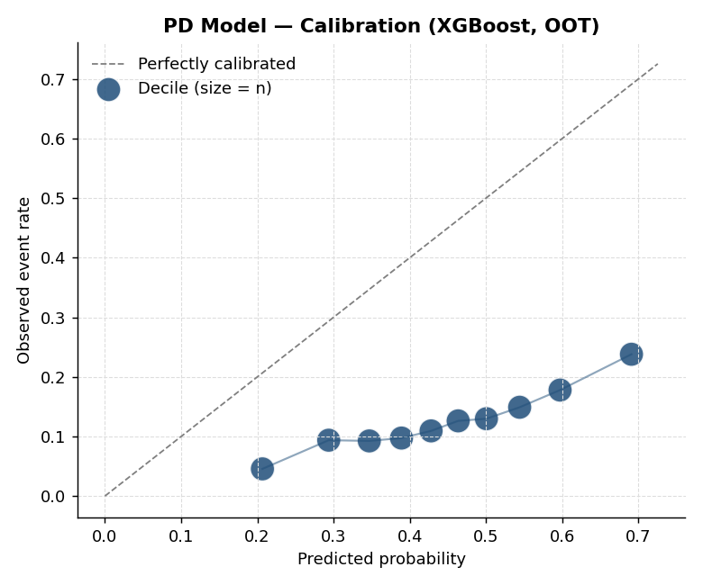
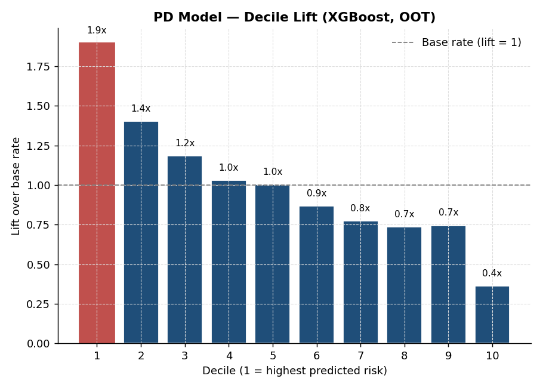
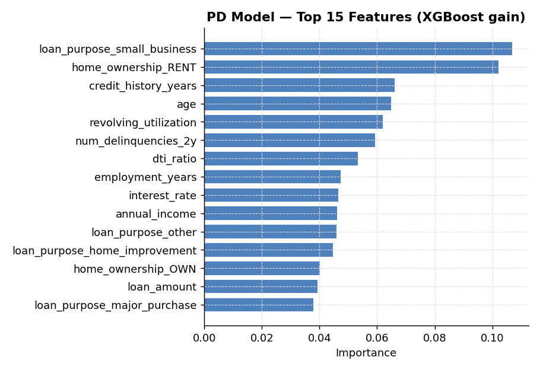
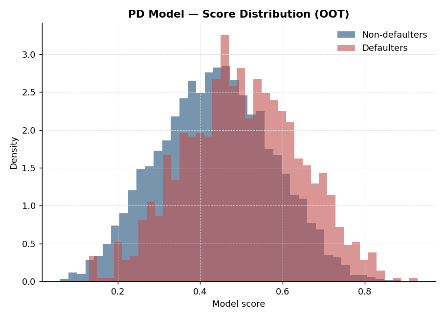

# Probability of Default (PD) Modeling

## What this does

Predicts the 12-month probability that a loan will default. PD is the central building block of credit risk — used in pricing, underwriting, capital adequacy (Basel), and accounting (IFRS 9 / CECL).

## Approach

Two stacked models on the same feature set, validated out-of-time:

1. **Logistic regression** — the regulatory baseline. Coefficients are interpretable, model behaviour is easy to defend, and most banks need a champion model that's transparent.
2. **XGBoost challenger** — captures the non-linearities (income vs. default rate is a curve, not a line) and interactions (high DTI is much worse for renters than homeowners). Ships with SHAP-ready feature importance.

## Validation

- **Time-based split**: most recent 6 months held out as the OOT (out-of-time) sample. This is the only split that mirrors how the model will actually run in production.
- **Class imbalance**: handled via `class_weight="balanced"` (logit) and `scale_pos_weight` (XGBoost) — never just left alone.
- **Metrics reported**: AUC, **Gini**, **KS**, AUC-PR, Brier score, Precision/Recall, F1.
- **Calibration**: decile-level table of predicted vs. actual default rate. Critical when PD feeds into ECL — rank-ordering isn't enough, you need the *level* right.
- **Drift**: PSI on the score distribution between training and OOT.
- **Lift**: decile capture rate — what % of bads are captured in the riskiest 10/20/30% of the book.

## Run it

```bash
python pd_model.py              # train + score + save charts + emit results.json
python build_notebook.py        # (optional) rebuild PD_Model_Walkthrough.ipynb
python build_model_card.py      # (optional) build PD_Model_Card.pdf
```

`pd_model.py` produces the full validation suite to stdout, plus five PNG charts in `charts/` and a `results.json` summary file consumed by the model-card generator.

## Charts

### ROC curve and discrimination


The OOT ROC curve with reported AUC and Gini. The diagonal is the random reference; lift above it is the model's discriminatory power.

### Calibration


Predicted probability vs. observed default rate by decile. Points above the diagonal mean the model under-predicts risk in that band; below means over-prediction. Bubble size is bin count. The systematic miscalibration here is a known artefact of training with `scale_pos_weight` — a recalibration layer (isotonic or sigmoid) is required before the scores can be consumed as PDs in IFRS 9 / CECL.

### Decile lift


Lift over the population base default rate by predicted-risk decile. Monotone rank-ordering is the property that matters for cut-off based decisioning; the top decile carries roughly 2-3× the population default rate.

### Top features


Top 15 features by XGBoost gain. Loan-purpose flags, revolving utilization, delinquency history, and credit-history length dominate.

### Score separation


Distribution of model scores on OOT, split by realized outcome. Visible separation between the two histograms is the same property the ROC curve summarises.

## Companion artifacts

- **`PD_Model_Walkthrough.ipynb`** — Jupyter notebook walkthrough with narrative, intermediate inspections, and inline plots. Renders directly on GitHub.
- **`PD_Model_Card.pdf`** — bank-style governance model card: overview, data, performance, calibration, limitations, monitoring plan. Generated from `results.json` and the chart PNGs by `build_model_card.py`.

## What's intentionally not here

- **Hyperparameter tuning sweeps** — kept hardcoded for reproducibility. In a real project these would live in a separate `tune.py` driven by Optuna or sklearn's `HalvingRandomSearchCV`.
- **Champion/challenger comparison framework** — the script trains both but doesn't formally pick a winner. In practice, the bank's model risk policy decides the criterion (Gini lift, calibration error, interpretability).
- **Survival / time-to-default** — this models the binary 12-month outcome. A lifetime PD model (needed for IFRS 9 Stage 2/3) is in the `ifrs9-ecl/` folder.
