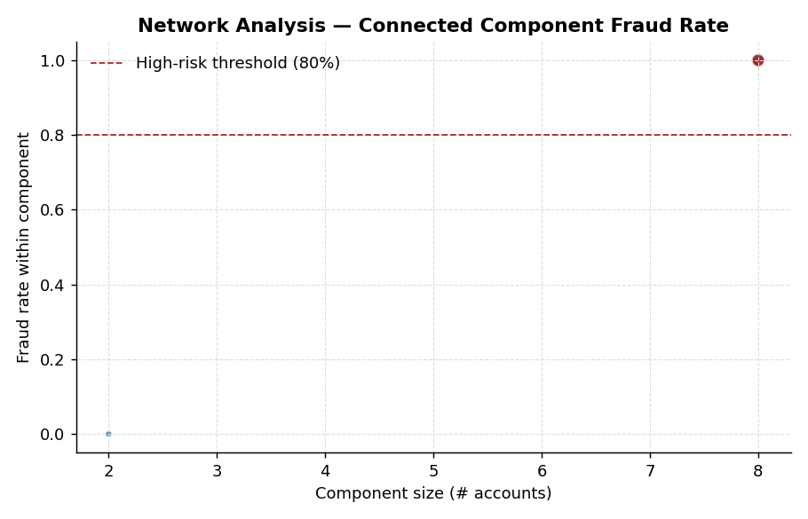

# Fraud Ring Detection via Graph Analysis

## What this does

Surfaces fraud rings — groups of seemingly unrelated accounts that are actually controlled by the same actor. The signal is shared identity attributes: a real customer doesn't share a device + IP + phone with five other "different" customers, but a fraud ring does.

## How it works

1. **Build a bipartite graph** between accounts and their identity attributes (device IDs, IP addresses, phone numbers).
2. **Project to an account–account graph** — link any two accounts that share at least one attribute. Edge weight = number of attributes shared.
3. **Apply a frequency cutoff** — drop attributes shared by 100+ accounts (these are usually proxies, mobile carriers, or normal-life coincidences, not fraud).
4. **Find connected components** — each component is a candidate ring.
5. **Score each component** by size and observed fraud rate. Large + high fraud rate = ring.
6. **Generate account-level features** — degree, weighted degree, component size, component fraud rate — that get fed back into the supervised application-fraud and transaction-fraud models.

This is the standard playbook for first-line ring detection. Real shops layer in:
- **Louvain or Leiden community detection** when components are too large to be useful
- **Temporal graphs** — was the link recent or historical?
- **Attribute weighting** — sharing an SSN is much stronger than sharing a Wi-Fi network

## Why graph features are powerful

Fraud rings in this synthetic example end up with:
- 5–10x higher degree than legitimate accounts
- Component sizes in the dozens
- Component fraud rates near 100%

A flat tabular model can't see this pattern — every transaction or application looks plausible on its own. The graph lifts the lid on the relationships and lets the supervised model use ring membership as a feature.

## Run it

```bash
python fraud_ring_detection.py
```

Output: stdout summary + two charts in `charts/`.

### Component fraud rate vs. size


Each dot is a connected component. Most components are small and have low fraud rate — those are normal coincidental attribute overlaps between unrelated accounts. The cluster of larger components at the high-fraud end is the fraud rings: they are big, dense, and almost entirely fraudulent.

### Graph features separate fraud from legit


Distribution of node degree and component size by fraud status. Fraud accounts sit in the long right tail of both — exactly the signal the supervised models cannot extract from tabular features alone.

## Production notes

- **Privacy** — graph data is sensitive. Hashing of phone, email, and address before graph construction is standard.
- **Graph databases** — at real scale (tens of millions of accounts) you'd use Neo4j, TigerGraph, or AWS Neptune rather than NetworkX. The algorithms are the same.
- **Streaming** — production fraud graphs update continuously. Each new transaction or application adds nodes/edges. Incremental community detection (e.g., DynaMo, sCD) replaces batch.
- **Consortium graphs** — the highest-signal version is cross-institutional. Vendor offerings: SardineAI, Sift Connect, LexisNexis Lattice. A single bank's graph misses fraud rings that operate across multiple lenders.
