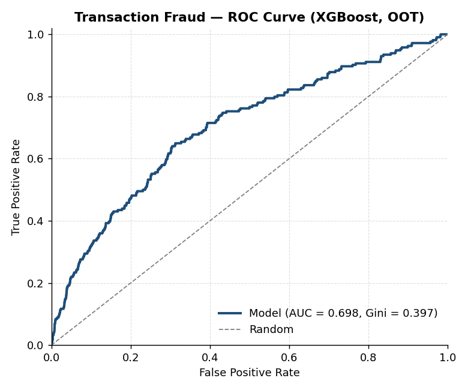
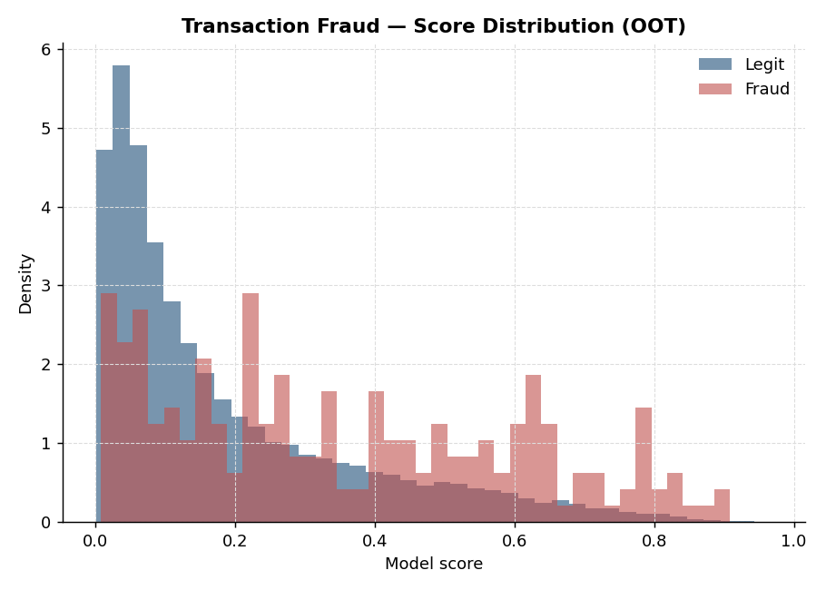
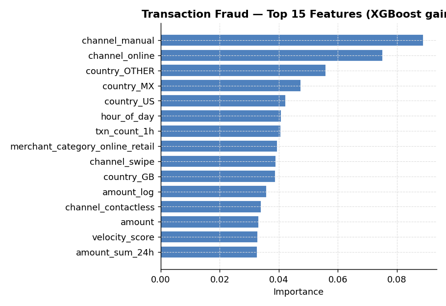
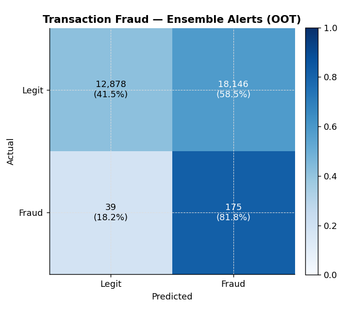

# Transaction Fraud Detection

## What this does

Scores card / payment transactions in near-real-time. The dataset has a ~0.5% fraud rate — typical for mixed card-present + card-not-present traffic. This is a much harder problem than credit risk: positives are rare, attackers adapt, and the cost of a false negative (let fraud through) and a false positive (block a legitimate customer's card) are both painful in different ways.

## Why two models

- **XGBoost (supervised)** — the workhorse. Learns from labeled fraud cases. Scales to billions of transactions and handles the heavy class imbalance via `scale_pos_weight`.
- **Isolation Forest (unsupervised)** — second line of defence. Runs in parallel and catches *novel* attack patterns that haven't been labeled yet. Critical for zero-day fraud where the supervised model has never seen the technique.

In production these run in parallel; the alert rule is "flag if either fires." That's exactly what this script implements at the end.

## Why the threshold isn't 0.5

Default-0.5 is meaningless under heavy class imbalance. Fraud teams pick the threshold that gives them the right number of alerts per day given their analyst capacity. The script tunes the threshold to hit a target **recall** (here 80%) on the validation set, then reports the resulting precision and alert volume.

The key operational metric reported is **precision @ top-K** — if the analyst team can investigate 500 alerts a day, what % of the top 500 by score are actual fraud? This is the number the head of fraud cares about.

## Key features in the model

- Transaction amount (log-transformed)
- Hour of day, night-time flag
- Velocity (count and sum of transactions in last 1h / 24h)
- Channel (chip / swipe / online / contactless / manual)
- Country, merchant category, device type

In a real deployment you'd also have:
- **Card-level features** — historical fraud rate, time since last txn, deviation from typical amount/merchant
- **Device intelligence** — fingerprint reuse across cards, IP reputation, geolocation mismatch with billing
- **Graph features** — shared phone/email/device between cards (see `../network-analysis/`)
- **Consortium signals** — bureau-style fraud feeds (e.g., Visa AA, Mastercard Decision Intelligence)

## Run it

```bash
python transaction_fraud.py
```

The script prints all metrics and saves five charts to `charts/`:

### ROC and Precision-Recall



ROC tells you the relative performance against random; the PR curve is the more informative view at the ~0.5% base rate, because it shows how precision degrades as you push to higher recall — exactly the operational tradeoff fraud ops makes.

### Score distribution


The two histograms have very different supports — the model puts most legitimate transactions near zero and most fraud near one. The overlap region is where the alert threshold trades precision for recall.

### Feature importance


XGBoost gain by feature. Velocity, amount, channel, and time-of-day signals dominate, consistent with industry intuition.

### Ensemble alerts


Confusion matrix for the ensemble alert rule (XGBoost above tuned threshold OR Isolation Forest in top 1% anomaly). Counts and row-normalized rates are shown.

## Performance considerations

This is set up for a batch evaluation, but the trained pipeline serializes cleanly with `joblib.dump(xgb, "model.joblib")` and scores at sub-millisecond latency in production. For real-time use you'd typically:
- Serve the model behind a low-latency API (FastAPI, gRPC, or a vendor decision platform like FICO Falcon / Featurespace ARIC)
- Maintain velocity features in a feature store (Redis, Tecton, Feast) updated on each transaction
- Run challenger models in shadow mode for A/B before promoting
