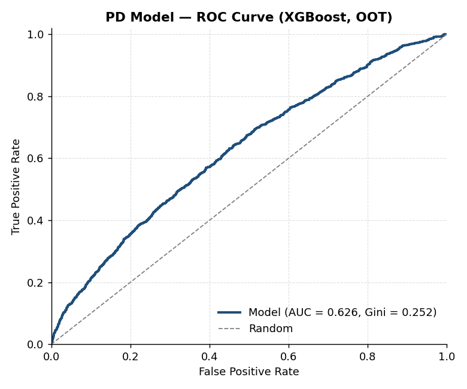
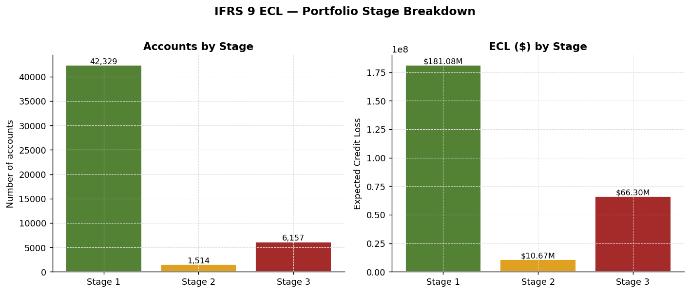
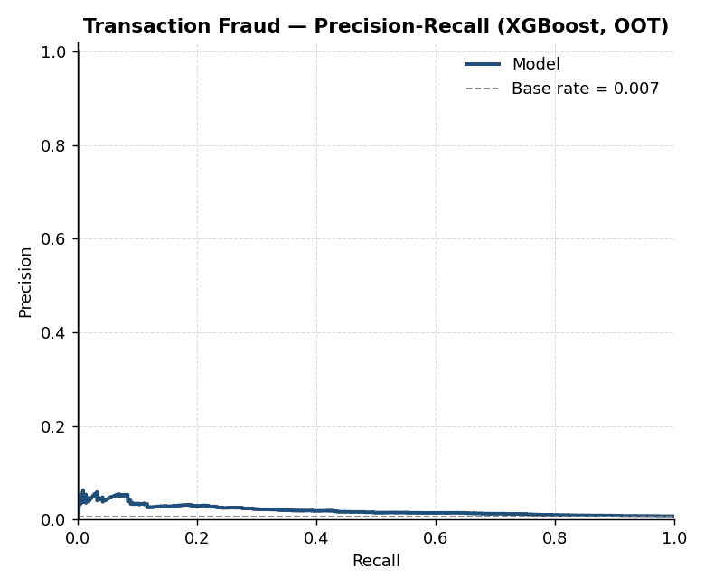
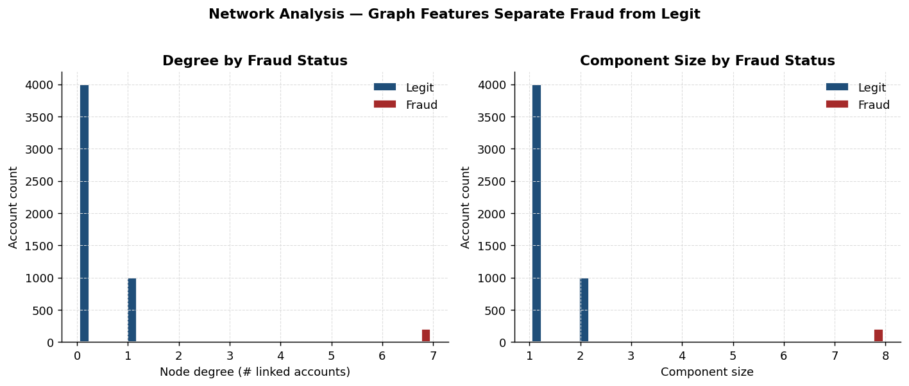

# Credit Risk & Fraud Risk Modeling Portfolio
# Credit Risk & Fraud Risk Modeling Portfolio

**Author:** Ram Kammela

A production-grade portfolio demonstrating end-to-end modeling work across the two pillars of consumer/commercial lending risk: **credit risk** (will the borrower pay?) and **fraud risk** (is this transaction or applicant legitimate?).

Every project here is runnable on synthetic data, follows industry conventions (Basel / IFRS 9 / FFIEC), and includes the validation diagnostics regulators and model risk teams actually look for: Gini, KS, PSI, calibration plots, stability over time, and explainability.

---

## Repository Map

```
credit-fraud-risk-portfolio/
├── 01-credit-risk-modeling/
│   ├── pd-modeling/          Probability of Default (PD) - logistic regression + XGBoost
│   ├── lgd-modeling/         Loss Given Default (LGD) - beta regression
│   ├── credit-scoring/       Application scorecard with WoE / IV / scaling to points
│   └── ifrs9-ecl/            IFRS 9 Expected Credit Loss (PD x LGD x EAD with staging)
│
├── 02-fraud-risk-modeling/
│   ├── transaction-fraud/    Real-time transaction fraud (XGBoost + Isolation Forest)
│   ├── application-fraud/    Application / synthetic-identity fraud at origination
│   └── network-analysis/     Graph-based fraud ring detection
│
├── 03-shared-utilities/      Reusable code: feature engineering, evaluation, monitoring
├── data/                     Synthetic data generators
└── docs/                     Methodology notes and deployment guide
```

---

## What's in Each Project

### Credit Risk

| Project | What it does | Key techniques |
|---|---|---|
| **PD Modeling** | Predicts 12-month default probability on a loan book | Logistic regression baseline, XGBoost challenger, SHAP explainability, KS / Gini / calibration |
| **LGD Modeling** | Predicts loss severity on defaulted accounts | Beta regression, two-stage model (cure vs. loss), recovery curves |
| **Credit Scoring** | Builds a points-based application scorecard | Weight of Evidence binning, Information Value, scaling to FICO-style points |
| **IFRS 9 ECL** | Computes Expected Credit Loss for accounting | 3-stage classification, lifetime PD, macroeconomic overlays |

### Fraud Risk

| Project | What it does | Key techniques |
|---|---|---|
| **Transaction Fraud** | Scores card / payment transactions in near-real-time | XGBoost on heavy class imbalance, Isolation Forest for unsupervised drift, velocity features |
| **Application Fraud** | Flags fraudulent applications at booking | Synthetic identity detection, device / velocity / consortium signals |
| **Network Analysis** | Surfaces fraud rings via shared attributes | Graph construction, community detection, suspicious-cluster scoring |

---

## Highlights at a Glance

Each project ships with charts and the metrics you'd expect to see in a real model package:

| Project | Sample chart |
|---|---|
| PD Modeling |  |
| IFRS 9 ECL |  |
| Transaction Fraud |  |
| Network Analysis |  |

Two **PDF deliverables** are also produced from script outputs:
- `01-credit-risk-modeling/pd-modeling/PD_Model_Card.pdf` — bank-style governance model card (overview, performance, calibration, limitations, monitoring).
- `01-credit-risk-modeling/ifrs9-ecl/IFRS9_ECL_Executive_Summary.pdf` — risk-committee summary with KPIs, stage breakdown, and methodology note.

A **Jupyter walkthrough** for the PD model:
- `01-credit-risk-modeling/pd-modeling/PD_Model_Walkthrough.ipynb` — narrative + code walkthrough that renders directly on GitHub.

---

## Getting Started

```bash
# clone the repo
git clone https://github.com/<your-username>/credit-fraud-risk-portfolio.git
cd credit-fraud-risk-portfolio

# set up environment
python -m venv venv
source venv/bin/activate              # on Windows: venv\Scripts\activate
pip install -r requirements.txt

# generate the synthetic data once (creates files in /data)
python data/generate_synthetic_data.py

# run any project, for example:
python 01-credit-risk-modeling/pd-modeling/pd_model.py
```

Every script is self-contained — it loads data, trains, validates, and prints metrics. No external data or credentials needed.

---

## Modeling Standards Used Throughout

- **Train / validation / out-of-time test split** — never just random; OOT mimics how the model will actually be used
- **Class-imbalance handling** — `scale_pos_weight` for XGBoost, SMOTE where appropriate, threshold tuning rather than blind 0.5
- **Calibration** — predicted probabilities matter (especially for ECL), not just rank-ordering
- **PSI monitoring** — Population Stability Index on features and scores to catch drift
- **Explainability** — SHAP values for any non-linear model, monotonicity constraints where the regulator expects them
- **Reproducibility** — fixed random seeds, pinned dependencies, deterministic data generation

---

## About This Portfolio

This repository is a working showcase, not a course or tutorial. The code is the kind I'd ship into a model risk environment: structured, validated, and traceable. If you're a recruiter, hiring manager, or fellow practitioner — start with `01-credit-risk-modeling/credit-scoring/` and `02-fraud-risk-modeling/transaction-fraud/`; those are the two most representative pieces.

## License

MIT — see [LICENSE](LICENSE).
